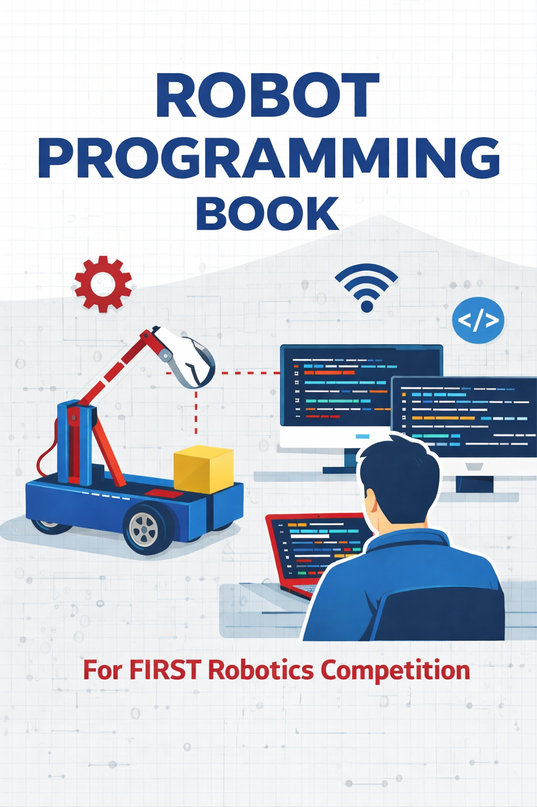

<h1 class="cover-title">Robot Programming Book</h1>

A practical guide to programming FRC robots. This guide is built for students who want to understand not just <em>how</em>, but <em>why</em>.

By <a href="https://www.linkedin.com/in/doshidev" target="_blank">Devang Doshi</a>

Hardware

This book progresses through three hardware phases.
XRP is a small, affordable educational robot from WPI — personal hardware, no team or lab required, deployable from your desk.
Swerve is a shared mini swerve robot running a roboRIO with real motor controllers (SparkMAX), a gyro, and a camera: full FRC hardware at a reduced scale.
Competition is a full FRC competition robot used for the final phases covering mechanisms, full-field autonomous, and season-ready architecture.

Sections

<h3>I. Foundations</h3>

Tools, Java, and Git. Variables, robot structure, conditionals, loops, and methods.

XRP

6 chapters

<h3>II. Driving, Sensing, and Real Hardware</h3>

Classes and objects, controller input, all XRP sensors, debugging with Git history, and a hands-on merge conflict lab.

XRP

5 chapters

<h3>III. Autonomous, Control Theory, and Simulation</h3>

Encoder and timer auto, kinematics, odometry, PID control, SysId characterization, and simulation with AdvantageKit IO layers.

XRP

6 chapters

<h3>IV. Command-Based Programming</h3>

Subsystems, commands, scheduler, button bindings, state machines, unit testing, and live dashboard tuning.

XRP

6 chapters

<h3>V. AdvantageKit Deep Dive and XRP Capstone</h3>

Log visualization and replay in AdvantageScope, a full capstone project bringing every XRP concept together.

XRP

2 chapters

<h3>VI. Real Hardware, Swerve Drive, and Vision</h3>

roboRIO and CAN bus, swerve kinematics, field-oriented drive, PathPlanner, SysId on brushless motors, and AprilTag vision with pose fusion.

Swerve

8 chapters

<h3>VII. Mechanisms, Full Auto, and Competition Systems</h3>

Arms, elevators, pneumatics, full-field autonomous with event markers, AdvantageKit match logging, and competition day process.

Competition

6 chapters

<h3>VIII. Appendices and Reference</h3>

Java and WPILib quick references, Git command guide, troubleshooting tables, and an XRP-to-roboRIO API mapping.

XRPSwerveCompetition

5 appendices

<strong>Open Source</strong> Free resource for FRC students worldwide. To contribute, suggest a topic, or report an error, email author <a href="mailto:doshidev@gmail.com">doshidev@gmail.com</a>

<strong>Disclaimer</strong>: Written for FIRST Robotics Competition (FRC) programming only. Not affiliated with, endorsed by, or associated with FIRST, WPI, or any other organization. An independent effort to create open source educational material for students across the world.

